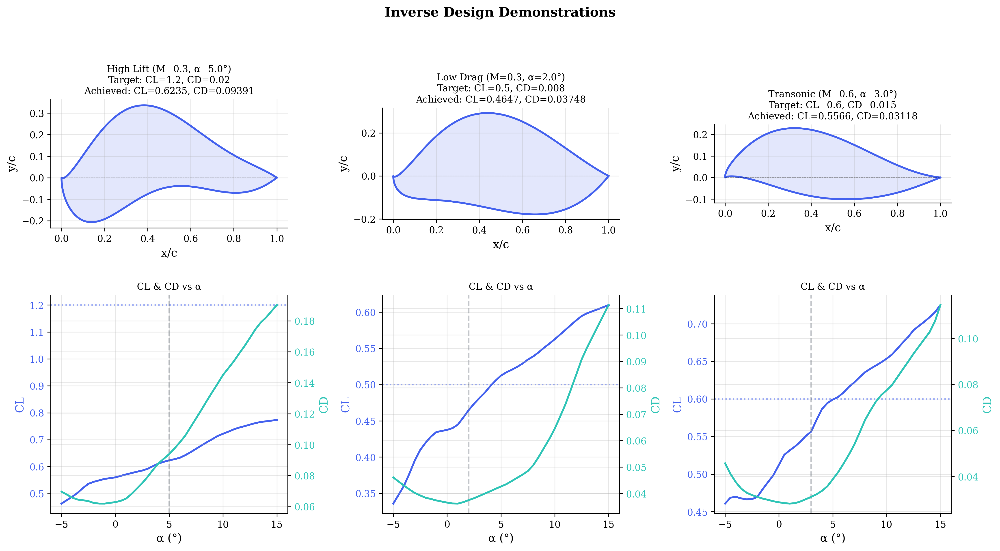
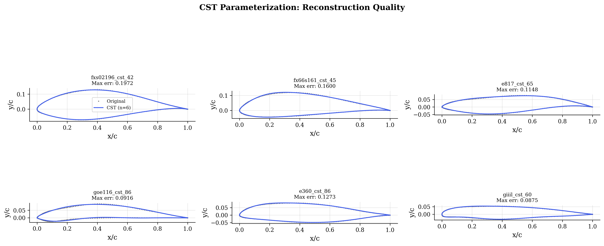
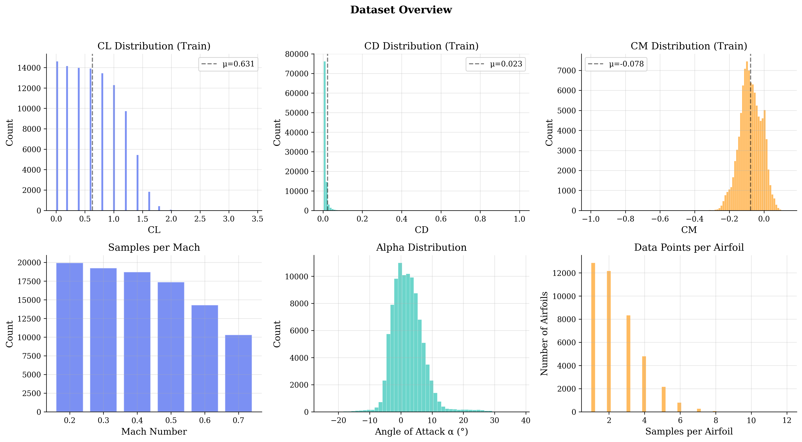
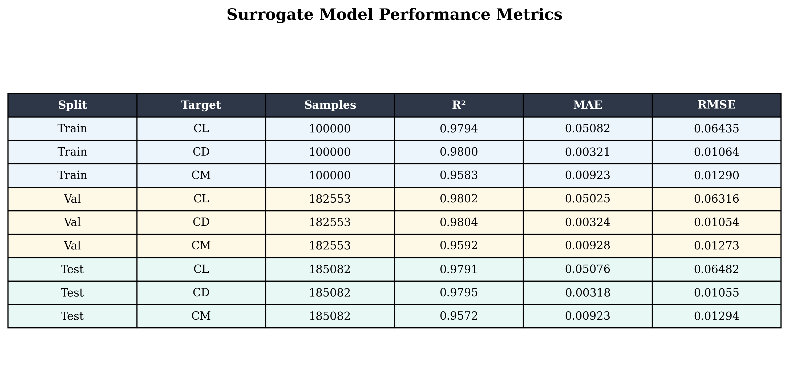
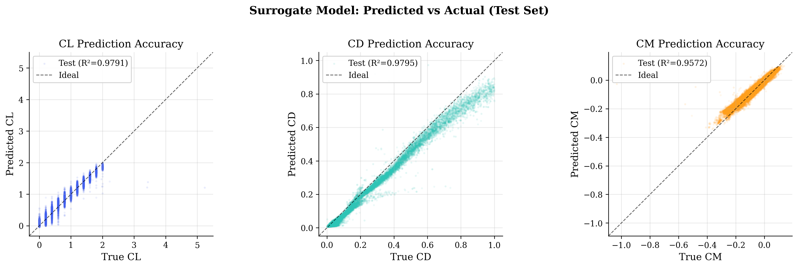
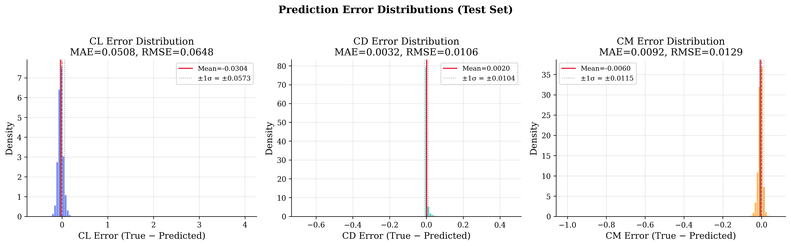
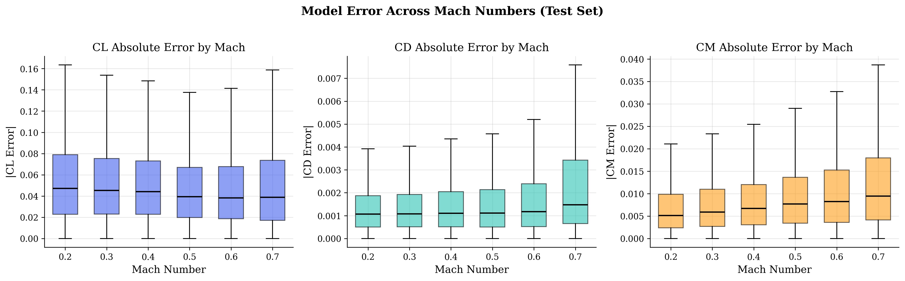
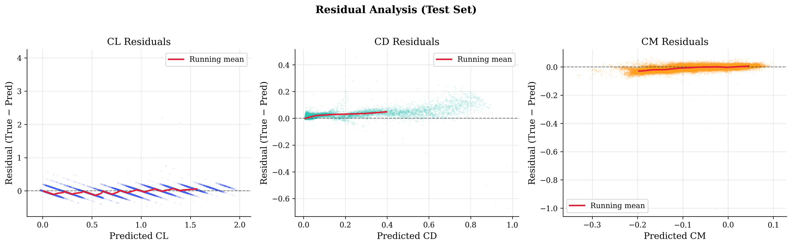
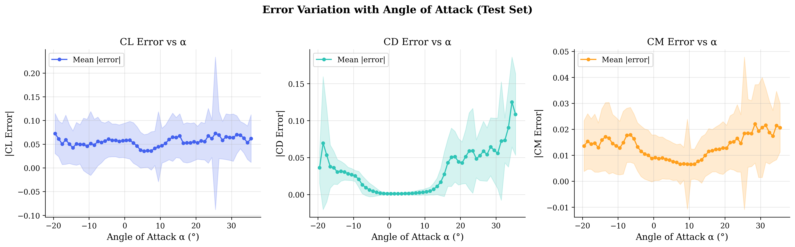
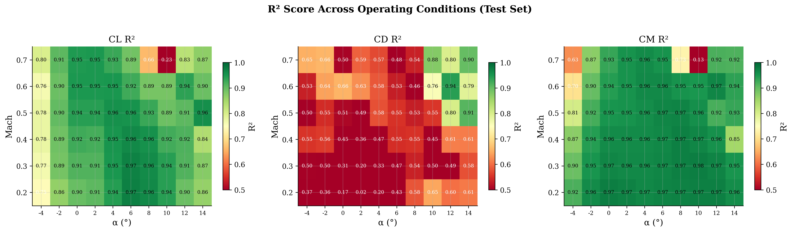

# AeroInverse — Surrogate-Based Inverse Airfoil Design System

> **AI-powered inverse airfoil design** using neural network surrogates trained on 1.48 million XFOIL simulations. Given target aerodynamic performance, the system finds the optimal airfoil geometry in seconds.

<p align="center">
  
</p>

---

## Table of Contents

- [Overview](#overview)
- [System Architecture](#system-architecture)
- [Methodology](#methodology)
  - [CST Parameterization](#1-cst-parameterization)
  - [Data Pipeline](#2-data-pipeline)
  - [Surrogate Model](#3-neural-network-surrogate-model)
  - [Inverse Design Optimization](#4-inverse-design-optimization)
- [Dataset](#dataset)
- [Results](#results)
  - [Model Performance](#model-performance)
  - [Parity Plots](#parity-plots)
  - [Error Analysis](#error-analysis)
  - [R² Across Operating Conditions](#r²-across-operating-conditions)
  - [CST Reconstruction Quality](#cst-reconstruction-quality)
- [Web Interface](#web-interface)
- [Project Structure](#project-structure)
- [Quick Start](#quick-start)
- [Technologies](#technologies)

---

## Overview

Traditional airfoil design relies on iterative CFD simulations — a process that is computationally expensive and time-consuming. This project replaces that inner loop with a neural network surrogate model, enabling **real-time inverse design**: the user specifies desired aerodynamic targets (C_L, C_D, C_M), and the system finds the optimal airfoil shape via optimization over a compact CST parameter space.

**Key Capabilities:**
- 🚀 **Real-time design** — Inverse optimization completes in seconds instead of hours
- 🎯 **High accuracy** — Surrogate model achieves R² > 0.97 on all coefficients
- 🔄 **Dual optimization** — Gradient-based (L-BFGS-B) + Evolutionary (Differential Evolution)
- 🌐 **Interactive UI** — Premium web dashboard for visual exploration
- 📊 **Comprehensive validation** — 185K+ test samples across 6 Mach numbers

---

## System Architecture

```
┌─────────────────────────────────────────────────────────────────────┐
│                    INVERSE DESIGN PIPELINE                         │
│                                                                     │
│  ┌──────────┐     ┌───────────┐     ┌──────────────┐     ┌───────┐ │
│  │  Target   │     │ Optimizer │     │  Surrogate   │     │  CST  │ │
│  │  Aero     │────▶│ L-BFGS-B  │────▶│  Neural Net  │────▶│Params │ │
│  │  Specs    │     │   or DE   │     │  (PyTorch)   │     │(12D)  │ │
│  │(CL,CD,CM)│     └───────────┘     └──────────────┘     └───┬───┘ │
│  └──────────┘           ▲                                     │     │
│                         │              Minimize               │     │
│                         │         ‖target - pred‖²            ▼     │
│                         │                              ┌──────────┐ │
│                         └──────────────────────────────│ Airfoil  │ │
│                                                        │  Shape   │ │
│                                                        │ (x,y)    │ │
│                                                        └──────────┘ │
└─────────────────────────────────────────────────────────────────────┘
```

```
┌─────────────────────────────────────────────────────────────────────┐
│                     TRAINING PIPELINE                               │
│                                                                     │
│  ┌──────────┐     ┌───────────┐     ┌──────────────┐     ┌───────┐ │
│  │  Airfoil  │     │    CST    │     │   Forward    │     │ XFOIL │ │
│  │  .dat     │────▶│  Fitting  │────▶│   Surrogate  │◀────│ Polar │ │
│  │  files    │     │ (6+6=12)  │     │   Training   │     │ Data  │ │
│  └──────────┘     └───────────┘     └──────────────┘     └───────┘ │
│   ~50K shapes      Bernstein          MLP 128→256         CL,CD,CM │
│                    polynomials        →256→128            @6 Mach   │
└─────────────────────────────────────────────────────────────────────┘
```

---

## Methodology

### 1. CST Parameterization

The **Class Shape Transformation (CST)** method represents airfoil geometry using Bernstein polynomials:

```
y(x) = C(x) · S(x) + x · Δz_TE
```

Where:
- `C(x) = x^0.5 · (1-x)^1.0` — Class function (round LE, sharp TE)
- `S(x) = Σ wₖ · Bₖ,ₙ(x)` — Shape function (Bernstein basis)
- `wₖ` — CST weight coefficients (6 upper + 6 lower = **12 parameters**)

This enables a **compact, continuous, smooth** design space where every point corresponds to a physically valid airfoil.

<p align="center">
  
</p>

### 2. Data Pipeline

The preprocessing pipeline (`preprocess_data.py`) performs:
1. **Coordinate parsing** — Reads ~50K airfoil `.dat` files from the shape database
2. **CST fitting** — Fits 12 CST coefficients to each airfoil via least-squares
3. **XFOIL polar parsing** — Extracts CL, CD, CM at each (Mach, α) condition
4. **Dataset consolidation** — Creates unified CSV with columns: `[airfoil_name, cst_0..11, mach, alpha, CL, CD, CM]`

<p align="center">
  
</p>

### 3. Neural Network Surrogate Model

A deep MLP maps the 14-dimensional input space to aerodynamic coefficients:

| Layer | Type | Dimension |
|-------|------|-----------|
| Input | — | 14 (12 CST + Mach + α) |
| Hidden 1 | Linear + BatchNorm + ReLU + Dropout(0.1) | 128 |
| Hidden 2 | Linear + BatchNorm + ReLU + Dropout(0.1) | 256 |
| Hidden 3 | Linear + BatchNorm + ReLU + Dropout(0.1) | 256 |
| Hidden 4 | Linear + BatchNorm + ReLU + Dropout(0.1) | 128 |
| Output | Linear | 3 (CL, CD, CM) |

**Training details:**
- **Optimizer**: Adam (lr=1e-3, weight decay=1e-5)
- **Scheduler**: ReduceLROnPlateau (factor=0.5, patience=5)
- **Early stopping**: patience=15 epochs
- **Total parameters**: 135,555

### 4. Inverse Design Optimization

Given target aerodynamic specifications, the optimizer minimizes:

```
J(w) = λ_CL · (CL_target - CL_pred(w))² + λ_CD · (CD_target - CD_pred(w))² + λ_CM · (CM_target - CM_pred(w))² + λ_reg · ‖Δw‖²
```

Two optimization strategies are available:

| Method | Type | Pros | Use Case |
|--------|------|------|----------|
| **L-BFGS-B** | Gradient-based | Fast (~1s), multi-start | Quick exploration |
| **Differential Evolution** | Evolutionary | Global search, robust | Final design |

---

## Dataset

| Property | Value |
|----------|-------|
| **Source** | CST-perturbed airfoils from UIUC database |
| **Solver** | XFOIL v6.97 |
| **Reynolds number** | 1 × 10⁶ |
| **Mach numbers** | 0.2, 0.3, 0.4, 0.5, 0.6, 0.7 |
| **Training samples** | 1,482,985 |
| **Validation samples** | 182,553 |
| **Test samples** | 185,082 |
| **Unique airfoils (train)** | 50,874 |
| **CST order** | 6 per surface (12 total params) |

---

## Results

### Model Performance

| Metric | CL | CD | CM |
|--------|-----|-----|-----|
| **R² (Train)** | 0.9794 | 0.9800 | 0.9583 |
| **R² (Val)** | 0.9802 | 0.9804 | 0.9592 |
| **R² (Test)** | 0.9791 | 0.9795 | 0.9572 |
| **MAE (Test)** | 0.0508 | 0.0032 | 0.0092 |
| **RMSE (Test)** | 0.0648 | 0.0106 | 0.0129 |

<p align="center">
  
</p>

### Parity Plots

Predicted vs actual values on the test set confirm excellent agreement across the full range of each coefficient:

<p align="center">
  
</p>

### Error Analysis

**Error Distributions** — The prediction errors are tightly centered around zero with near-Gaussian distributions:

<p align="center">
  
</p>

**Error vs Mach Number** — The model performs consistently across all Mach conditions:

<p align="center">
  
</p>

**Residual Analysis** — No systematic bias is observed across the prediction range:

<p align="center">
  
</p>

**Error vs Angle of Attack** — Accuracy remains high across the α sweep:

<p align="center">
  
</p>

### R² Across Operating Conditions

The heatmap shows how model accuracy varies across the full Mach × α design space:

<p align="center">
  
</p>

### CST Reconstruction Quality

The CST parameterization faithfully captures complex airfoil geometries with only 12 parameters:

<p align="center">
  
</p>

---

## Web Interface

An interactive dark-mode dashboard built with Flask, HTML, CSS, and vanilla JS:

- 🎛️ **Target Input Panel** — Sliders for CL, CD, CM targets with importance weights
- ✈️ **Airfoil Canvas** — Real-time SVG rendering of the designed geometry
- 📈 **Performance Plots** — CL-α, CD-α, L/D, and drag polar curves
- 📤 **Export** — Download designed airfoil coordinates as `.dat` file

```bash
conda activate localgpt
python app.py
# Open http://localhost:5000
```

---

## Project Structure

```
Project Work 1/
├── cst_module.py              # CST parameterization (fit/reconstruct)
├── preprocess_data.py         # Data pipeline: XFOIL → CSV dataset
├── surrogate_model.py         # PyTorch MLP surrogate definition
├── train_surrogate.py         # Training script (early stopping, plots)
├── sklearn_surrogate.py       # Scikit-learn fallback model
├── inverse_design.py          # Inverse optimizer (gradient + evolutionary)
├── generate_report_figures.py # Report figure generator (10 plots)
├── app.py                     # Flask web application
├── requirements.txt           # Python dependencies
├── templates/
│   └── index.html             # Web dashboard HTML
├── static/
│   ├── style.css              # Premium dark-mode stylesheet
│   └── app.js                 # Frontend application logic
├── models/
│   └── best_surrogate.pth     # Trained PyTorch checkpoint
├── processed_data/
│   ├── train.csv              # 1.48M training samples
│   ├── val.csv                # 182K validation samples
│   └── test.csv               # 185K test samples
├── plots/report/              # All validation figures
├── Shape/                     # Raw airfoil coordinate data
└── Aerodynamic/               # Raw XFOIL polar results
```

---

## Quick Start

```bash
# 1. Install dependencies
pip install -r requirements.txt

# 2. Preprocess dataset (≈2 hours, one-time)
python preprocess_data.py

# 3. Train surrogate model (≈5 min on GPU)
python train_surrogate.py --epochs 100

# 4. Generate report figures
python generate_report_figures.py

# 5. Launch web application
python app.py
# → Open http://localhost:5000
```

---

## Technologies

| Category | Stack |
|----------|-------|
| **ML Framework** | PyTorch 2.5 (CUDA 12.1) |
| **Scientific** | NumPy, SciPy, Pandas, Scikit-learn |
| **Visualization** | Matplotlib |
| **Web** | Flask, HTML5 Canvas, Vanilla CSS/JS |
| **Data Source** | XFOIL v6.97 |
| **Parameterization** | Class Shape Transformation (CST) |

---

*Final Year University Project — Surrogate-Based Inverse Airfoil Design System*
